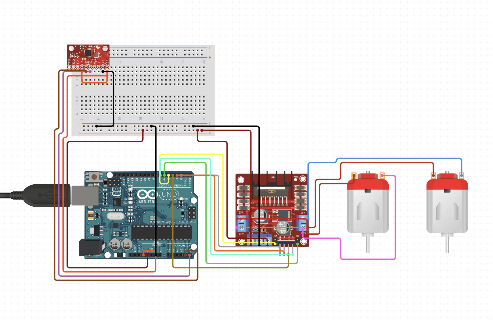

# Create the Robot

## Hardware
 - print the 3D parts (see `STL_files` directory)
 - [1] x Jetson Nano
 - [1] x L298N Dual H-Bridge Module
 - Switch for power supply
 - [2] x JSumo Titan Dc Gearhead Motor 12V 200 RPM
 - [2] x Jsumo JS5230 Aluminum - Silicone Wheel Set
 - [2] x caster ball
 - (Arduino UNO R3 with MPU 6050) or Arduino Nicla Sense ME
 - [2] x 5200mAh 3S 11.1V LiPo Battery (motors and Jetson Nano)
 - [1] x DC-DC Buck Converter Step Down Module (to drop the voltage from 11.1V to 5V for the Jetson Nano)
 - M3 screws and nuts
 - Jumper wires
 - Spacers

## Assemble the robot
The assembly of the robot is shown in the following video:


Final assembly of the robot:


## Wires Connection
if you are using the Arduino UNO R3 with MPU 6050, connect the wires as shown in the following photo:



or you can change the pins in the `arduino/arduino.ino` file.

if you are using the Arduino Nicla Sense ME, connect the wires as they are on `arduino/nicla.ino` file.


## Environment Preperation
Ensure to have miniconda installed on the Jetson Nano, then run this command to install the required packages:
```
make virenv
```
then activate the virtual environment:
```
conda activate pid-tuner-env
```
finally, install the packages and the repo package (`PID Tuning for Motion Optimization`) by running the following command:
```
make install
```

## Run the Robot
First you need to donwload the MPU6050 library from [here](https://github.com/alibustami/MPU6050_light) as zip file, then added it to arduino as a library.

Then, you need to upload the `arduino/arduino.ino` file to the Arduino board.

All the configurations are in the `configuration.yaml` file, you can change the values as needed. To run the robot, execute the following command:
```
python src/optimizers/trial.py
```
